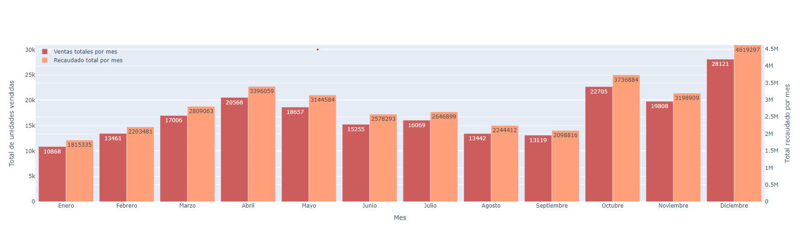
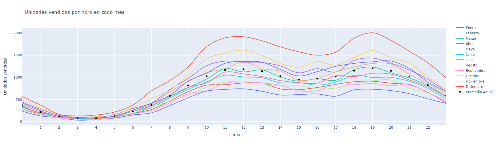
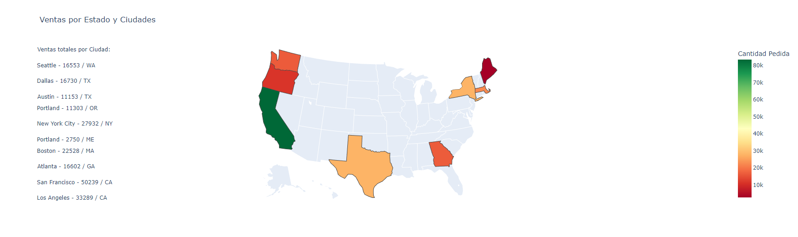
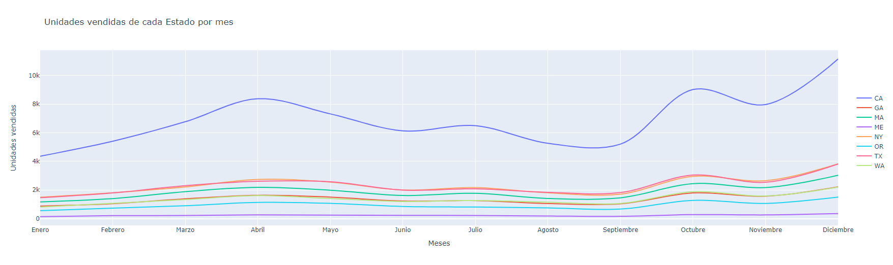
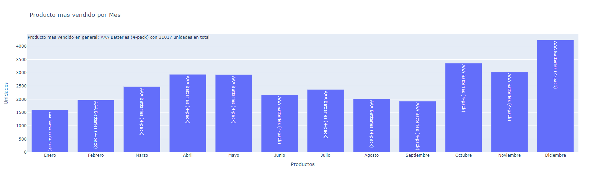
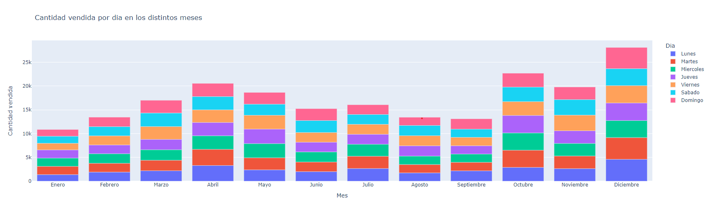
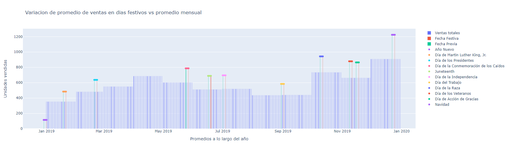

# **Informe anual de ventas**
---
## Integrantes
* Gabriel Huck
* Alejandro Grosso
* Lucas Gomez Peña
---
## **Una Revisión a las Tendencias en el Mercado de Electrónica**
---
### **Resumen**

El análisis anual de las ventas en Estados Unidos es imprescindible para comprender su economía diversa y su influencia global. Este proceso arroja luz sobre tendencias y preferencias que informan las decisiones empresariales y las políticas públicas. Estados Unidos, como epicentro del consumo global, ejerce una influencia notable en los mercados internacionales. Este informe se enfoca en el análisis de las ventas de productos electrónicos en diferentes estados durante el año 2019, considerando factores geográficos, estacionales y horarios para entender las preferencias de los consumidores.

Para ello, se recopilaron datos de ventas de productos electrónicos y se aplicaron técnicas de análisis de datos y big data. Los resultados revelaron que los meses de octubre y diciembre, coincidiendo con la temporada navideña, registraron las ventas más altas, seguidos de cerca por el mes de abril. Por el contrario, enero, agosto y septiembre mostraron los niveles de ventas más bajos. Además, se identificó que la demanda es más alta alrededor del mediodía y a las 19 horas durante los días laborables, con un mínimo durante las primeras horas de la madrugada. Los días de mayor demanda se corresponden con los lunes, martes y sábados.

En resumen, este estudio proporciona información valiosa para adaptar y personalizar estrategias de marketing según el tiempo, la ubicación geográfica y eventos especiales, lo que permite a las empresas maximizar su eficacia en un mercado en constante cambio.

### **Introducción**

El análisis de datos anual de ventas de productos en Estados Unidos es un ejercicio esencial para comprender y anticipar la dinámica económica y comercial de una de las economías más grandes y diversas del mundo (Rodrigues-Pose & von Berlepsch, 2018). Este análisis ofrece una ventana a la interacción entre los consumidores, las empresas y las fuerzas económicas que impulsan el mercado. Más allá de considerar un período muy corto de tiempo, este proceso revela valiosas tendencias, preferencias y comportamientos que orientan la toma de decisiones tanto en el ámbito empresarial como en la formulación de políticas públicas.

Estados Unidos, como epicentro de la innovación y el consumo global, ejerce una influencia significativa en los mercados internacionales (Arora et al., 2006). La nación es conocida por su diversidad demográfica, su cultura de consumo dinámica y su capacidad para adoptar rápidamente nuevas tecnologías y productos. Por lo tanto, el análisis de sus ventas anuales proporciona información no solo sobre el estado de la economía estadounidense, sino también sobre las tendencias que pueden extenderse a nivel global.

La importancia del análisis de ventas radica en áreas clave como la tecnología y la identificación de tendencias económicas que proporciona indicadores cruciales sobre el estado de la economía de Estados Unidos. Las fluctuaciones en las ventas pueden ser indicativos de recesiones, expansiones o cambios en la demanda del consumidor, lo que a su vez influye en la formulación de políticas económicas. Mientras que los datos anuales de ventas desglosados por categorías de productos revelan las preferencias cambiantes de los consumidores. Esto es especialmente relevante en una sociedad que experimenta cambios demográficos y culturales significativos.

Por otra parte, las empresas, desde pequeñas startups hasta gigantes corporativos, utilizan el análisis de ventas para ajustar sus estrategias de mercado, gestionar el inventario y tomar decisiones sobre expansión o diversificación de productos. Conocer la tendencia en el corto tiempo de las ventas anuales puede utilizarse para proyectar escenarios en el corto plazo, lo que permite a las empresas y a los inversores anticipar demandas y oportunidades (Patel et al., 2022).

Este tipo de investigaciones no solo se limita al ámbito privado, sino que influyen en la toma de decisiones gubernamentales relacionadas con impuestos, regulaciones comerciales y políticas de estímulo económico. La importancia de Estados Unidos en la economía global, el análisis de sus ventas anuales proporciona información vital para otros países y organizaciones internacionales que comercian o interactúan con el país.

El objetivo de este informe es analizar la variabilidad de las ventas de productos electrónicos de las tiendas online para diferentes estados, teniendo en cuenta factores como la distribución geográfica, las diferentes épocas del año y los días especiales. Además, se busca conocer la franja horaria donde se produce la mayor demanda de productos y las preferencias de los consumidores de los lugares bajo estudio.

### **Metodología**

Para realizar el análisis de tendencias en el siguiente informe se adquirieron datos de ventas de productos electrónicos en diferentes estados de Estados Unidos correspondientes al año 2019. Los dataframes se encontraban en archivos separados por meses con formato cvs y para su preprocesamiento se utilizó la librería Pandas de Python en el IDE Colab (Google Research). Primero se concatenaron los mismos de forma de obtener un solo dataframe con los datos de todo el año. Luego, se llevó a cabo la limpieza de estos con la eliminación de datos nulos, nan y erróneos mediante las funciones que ofrece el lenguaje, y la posterior conversión de tipos de datos string a fechas o diferentes formatos numéricos.

Posteriormente se efectuó un análisis exploratorio de los datos (EDA) con el fin de comprender la estructura y características de estos. Mediante la utilización de métricas descriptivas como el promedio, la desviación estándar y la visualización de estos se establecieron criterio para optar los tipos de gráficos más adecuados para su interpretación. 

Para graficar los datos se optó por la biblioteca Plotly debido a la versatilidad que ofrece respecto a otras. Además, tiene ventajas significativas en términos de interactividad, variedad de gráficos, facilidad de uso, personalización y capacidad de exportación. De este modo, para la visualización de las tendencias se utilizaron gráficos de línea, estos permiten la observación de los aumentos y disminuciones, entre otros patrones, de una forma sencilla cuando no se trata de nubes de puntos. Mientras que la estacionalidad se analizó mediante la adición de líneas verticales en fechas correspondientes a días festivos, de esta manera puede apreciarse el comportamiento de la curva alrededor de puntos críticos.

### **Resultados**

A partir de los dataframes procesados que contienen información sobre los productos vendidos en línea en diferentes estados de Estados Unidos, se realizó un análisis cuantitativo y cualitativo. El mismo brinda información sobre el comportamiento de las ventas durante el año, métricas que permiten optimizar la publicidad y el patrón de ventas horario, como se distribuyen estas, la tendencia de estas, cuál es el producto más demandado y qué influencia tienen los eventos especiales sobre este tipo de mercado.

La fig. 1 muestra la variación que sufrieron las ventas en los distintos meses del año, donde es posible apreciar que durante los meses de enero, agosto y septiembre los valores fueron menores al resto del año y los picos mayores se encuentran en octubre y diciembre. Teniendo en cuenta esto, la cantidad máxima de ventas ocurre en el mes de diciembre con un total de 28.121 mil productos y la mínima durante el mes de enero con 10.868 productos. Por otra parte, se muestra en color naranja, el total recaudado por mes donde el mismo guarda relación con el número de productos vendidos.

*Figura 1 - Ventas totales por mes*

El conocimiento del patrón de ventas por hora permite optimizar la publicidad para promover el aumento en las ventas y obtener mayores ingresos. Comprender cuándo los clientes tienden a comprar con mayor frecuencia y en qué momentos las ventas son más bajas permite a las empresas adaptar sus campañas publicitarias de manera precisa. Para este caso en particular (fig. 2) que la mayor cantidad de ventas tienen lugar en horas cercanas al medio día, entre 10 y 14 horas, y alrededor de las 19 horas. Mientras que las mínimas ocurren en horas de la madrugada.

*Figura 2 - Unidades vendidas por hora por cada mes*

Los datos analizados se corresponden a la cantidad de ventas en algunos de los estados de Estados Unidos que se muestran en la fig. 3. Con el fin de diferenciar el consumo en distintas regiones del país, se obtuvo que la mayor demanda ocurrió en las ciudades de San Francisco y Los Ángeles en el estado de California con un total de 50.239 y 33.289 unidades respectivamente, mientras que la menor demanda tuvo lugar en Portland (estado de Maine) con unas 2.750 unidades vendidas. Por otro lado, continúan la lista descendente, Nueva York con un total de 27.932, seguido por el estado de Texas con 27.883 (donde 11.153 corresponden a Austin y 16.730 a Dallas) y Portland del estado de Oregón y Boston de la Mancomunidad de Massachusetts con un total de 22.528 unidades pedidas.

*Figura 3 - Ventas por ubicación*

*Figura 4 - Unidades vendidas de cada Estado por mes*

Las tendencias en las ventas de cada estado muestran fluctuaciones mensuales significativas (fig. 4), siendo más marcadas en el estado de California donde se observan picos máximos en los meses de abril octubre y diciembre. Mientras que las ventas mínimas son registradas en enero y septiembre. A diferencia del resto de los estados, Maine presenta una tendencia cuasi-constante en las ventas registradas. Sin embargo, el producto más vendido en todos los estados (fig. 5) fueron las Baterías AAA en el paquete de 4 unidades.

*Figura 5 - Producto mas vendido por mes*

La cantidad de ventas diarias en los diferentes meses tiene una alta variabilidad (fig. 6), registrándose mayor cantidad durante los meses de diciembre y octubre, seguidos por abril, noviembre y mayo. Durante los días de la semana, en los meses de abril y diciembre se registran mayor cantidad de pedidos los lunes, martes y sábados, y con los mínimos durante los días jueves y domingos. Sin embargo, durante los meses de enero, febrero, agosto y septiembre, la cantidad de ventas se mantiene similar durante los días de la semana.

*Figura 6 - Cantidad vendida por dia en los distintos meses*

Si se tiene en cuenta el factor de días festivos (Anexo: Tabla 1), existe un patrón destacado en el período previo extendiéndose hasta dicha fecha (Fig. 7). Aquí, se observa un notable incremento en la cantidad de productos vendidos en comparación con el promedio mensual cercano a las fechas festivas. En general, este incremento se sitúa en torno al 30%. Sin embargo, es importante señalar que tres fechas específicas —Día de Martin Luther King, Jr., Juneteenth y Día de la Independencia— exhiben un crecimiento excepcional que supera en un 5% al promedio de crecimiento de estas festividades en comparación con otras fechas festivas como el Día del Trabajo. Este fenómeno refleja la influencia significativa de estos eventos en el comportamiento de compra, contribuyendo a un aumento adicional en las ventas.

*Figura 7 - Variacion de promedio de ventas en dias festivos vs promedio mensual*

### **Discusión**

Los resultados expuestos anteriormente obtenidos por análisis de técnicas de big data para varios estados de los Estados Unidos revela tendencias significativas en las ventas de productos e insumos electrónicos. El aumento en las ventas en línea permite visualizar importantes datos en materia de preferencias de consumo, productos mayormente demandados, franja horaria en donde el público realiza sus compras y estadísticas que permiten mejorar la publicidad acerca de ciertos artículos. Existen variaciones estacionales y patrones que se repiten en distintas regiones del país que se discutirán a continuación.

En primer lugar, se observó una variación mensual significativa en las ventas, con octubre y diciembre como los meses con picos más altos de ventas y enero como el período más bajo. Esto sugiere la importancia de la planificación de estrategias de marketing y promociones para aprovechar los momentos de alta demanda. Además, un análisis adicional mostró que existe un patrón de ventas por hora, donde la mayoría de las ventas ocurren alrededor del mediodía y en las primeras horas de la tarde, con un pico nuevamente alrededor de las 19 horas. Este conocimiento horario es valioso para la optimización de campañas publicitarias y para garantizar que los productos estén disponibles cuando los clientes son más propensos a comprar.

Al observar las ventas por estado, se identificó una clara diferenciación geográfica en la demanda de productos. Las ciudades de San Francisco y Los Ángeles, en California, lideraron en términos de demanda, mientras que otras regiones, como Portland en Maine, mostraron una demanda significativamente menor. Este hallazgo respalda la idea de que las estrategias de marketing deben adaptarse a las preferencias y necesidades específicas de cada región.

Por otra parte, la tendencia mensual de las ventas mostró fluctuaciones marcadas, especialmente en California, con picos máximos en abril, octubre y diciembre, y valles en enero y septiembre. En contraste, Maine mantuvo una tendencia más constante a lo largo del año. Esta información es esencial para la planificación de inventario y la gestión de la cadena de suministro. Aunque, independientemente del estado, el producto más vendido resultó ser el paquete de 4 baterías AAA. Este dato tiene implicaciones directas para la gestión de inventario y la toma de decisiones sobre qué productos promocionar con mayor énfasis.

Finalmente, se observó un impacto significativo de eventos especiales en las ventas. En el período previo y durante los días festivos, se produjo un aumento sustancial en las ventas en comparación con el promedio mensual, con un incremento general del 30%. Sin embargo, tres fechas específicas, como el Día de Martin Luther King, Jr., Juneteenth y el Día de la Independencia, superaron este promedio en un 5%, lo que resalta la influencia significativa de estos eventos en el comportamiento de compra.

### **Conclusiones**

El análisis de tendencias a partir de registro de datos en el estudio de ventas en línea ofrece numerosas ventajas. Permite identificar patrones de comportamiento del consumidor, anticipar demandas estacionales y optimizar estrategias de marketing en función de datos precisos sobre cuándo, dónde y qué productos son más demandados. Para este caso en particular, el método resulta útil para identificar patrones de consumo por estado, por fechas específicas y por horario. Así como detectar el consumo mensual.

Los resultados muestran una fluctuación significativa en volúmenes de ventas entre distintos períodos del año, pudiéndose destacar los meses de octubre y diciembre como picos máximos, mientras que los mínimos ocurren en los meses de invierno, agosto y septiembre (período invernal y otoñal del hemisferio norte). De la misma manera ocurren diferencias respecto a la ubicación geográfica, donde estas pueden atribuirse a la densidad demográfica y hábitos de consumo de la región. Cabe destacar que los volúmenes máximos en ventas ocurrieron en el estado de California mientras que los mínimos se registraron en el estado de Maine.

Este estudio, además, permitió identificar patrones horarios y diarios de preferencia del público para realzar sus compras. Los picos máximos registrados en horas cercanas al medio día y por la tarde temprano, mientras el otro ocurre alrededor de las 19 horas, mientras que por la madrugada se registran los valles. Del mismo modo se analizaron las variaciones diarias, donde se obtuvo que el volumen de compras en los días de la semana no se mantiene constante durante todos los meses del año. Durante los meses de diciembre y octubre se registraron las mayores ventas durante los lunes, martes y sábados mientras que en enero, febrero, agosto y septiembre fueron menores y mantuvieron uniformidad respecto a los días. Una posible explicación es debido a que existen días festivos o especiales comprendidos en esos meses, especialmente en diciembre donde tiene lugar la Navidad y ocurre el máximo, superando un 30% al resto del año.

En conjunto, estos resultados señalan la importancia de la adaptación y personalización de las estrategias de marketing según el tiempo, la ubicación geográfica y la relevancia de los eventos especiales. Este enfoque integral en la comprensión de las tendencias de ventas permite a las empresas optimizar sus estrategias y maximizar sus ingresos en el mercado en línea en constante cambio.

### **Referencias**

* Arora, Vivek & Vamvakidis, Athanasios. 2006. "The Impact of U.S. Economic Growth on the Rest of the World: How Much Does It Matter?," Journal of Economic Integration, Center for Economic Integration, Sejong University, vol. 21, pages 21-39.
* Curtis C., Garín J., Lester R. 2022. “Working, consuming, and dying: Quantifying the diversity in the American experience”. Journal of Economic Dynamics and Control. Vol: 138.
* PARKER K., MENASCE HOROWITZ J., BROWN A., FRY R., D’VERA COHN AND IGIELNIK R. 2018. Demographic and economic trends in urban, suburban and rural communities. WHAT UNITES AND DIVIDES URBAN, SUBURBAN AND RURAL COMMUNITIES. [Link](https://www.pewresearch.org/social-trends/2018/05/22/demographic-and-economic-trends-in-urban-suburban-and-rural-communities/) 
* Patel Z., Jaiswal R., Potdar G., Khodaskar M.R. 2022. A SURVEY PAPER ON BIG DATA ANALYTICS IN SALES AND MARKETING. 10. c420-c428.
* Rodríguez-Pose A, von Berlepsch V. (2018) “Does Population Diversity Matter for Economic Development in the Very Long Term? Historic Migration”. Diversity and County Wealth in the US. Eur J Popul. Vol: 35(5):873-911.
* Smith A., Jakob Stöber J., Ulrich. 2020. How data analytics helps sales reps win more deals. McKinsey & Company. [Link](https://www.mckinsey.com/capabilities/growth-marketing-and-sales/our-insights/how-data-analytics-helps-sales-reps-win-more-deals)  
* Smith M. 2023. International survey: is there too much American influence on national culture? YouGov: Society International. [Link](https://yougov.co.uk/international/articles/45518-international-survey-there-too-much-american-influ?redirect_from=%2Ftopics%2Finternational%2Farticles-reports%2F2023%2F04%2F06%2Finternational-survey-there-too-much-american-influ)
* Wilkie W. & David M. Gardner D. M. (1974). The Role of Marketing Research in Public Policy Decision Making. Journal of Marketing. Vol. 38, No. 1. pp. 38-47

### **Anexo**

Tabla 1. Días festivos.

|Festividad|Fecha|
|---|---|
|Año nuevo|01/01/2023|
|Día de Martin Luther King, Jr.|21/01/2019|
|Día de los presidentes|22/02/2019|
|Día de la Conmemoración de los Caídos|27/05/2019|
|Juneteenth|19/06/2019|
|Día de la Independencia|04/07/2019|
|Día del Trabajo|2/09/2019|
|Día de la Raza|12/10/2019|
|Día de los Veteranos|11/11/2019|
|Día de Acción de Gracias|18/11/2019|
|Navidad|25/12/2019|
